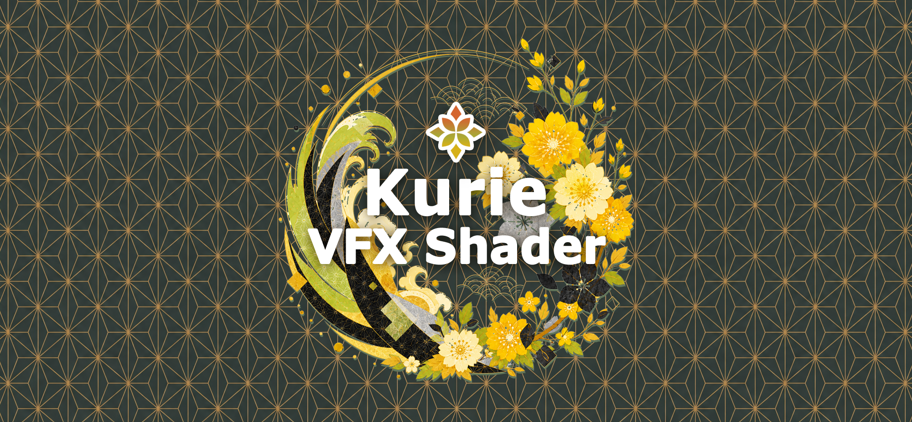
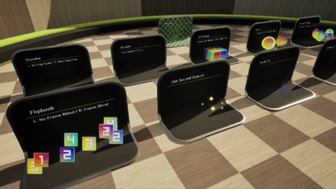

  

# UE5 Kurie VFX Shader

「**Kurie VFX Shader**」はエフェクト制作でよく使われる機能をまとめた UE5 の汎用マスターマテリアルのパックです。

  

## 🧩特徴
- 再利用可能でカスタマイズしやすいマテリアル
- VFX向けの汎用的な機能を搭載
- サンプルマップを用意
- ZIPでダウンロードして放り込むだけでUE5プロジェクトに簡単に導入可能

## 🧩使い方
導入方法や使い方はこちらのマニュアルをご覧ください。  
[UE5 Kurie VFX Shader マニュアル](https://zenn.dev/kurie/books/4e27d7a6dc84de)

## 🧩機能
  - フリップブック
  - 複数テクスチャのブレンド
  - UVの設定いろいろ
  - ソフトパーティクル
  - フレネル
  - ディゾルブ
  - 屈折

## 🧩License
MIT License です。
商用・個人利用問わず自由に使用できます。

## 🧩Updates
- 2026/05/05 ... v1.0 リリース